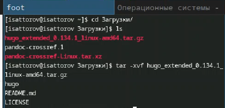
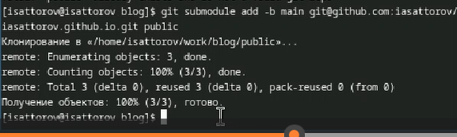

---
## Front matter
lang: ru-RU
title: Индивидуальный проект. Стадия 1.
subtitle: Презентация
author:
  - Сатторов И.
institute:
  - Российский университет дружбы народов, Москва, Россия
date: 4 сентября 2024

## i18n babel
babel-lang: russian
babel-otherlangs: english

## Formatting pdf
toc: false
toc-title: Содержание
slide_level: 2
aspectratio: 169
section-titles: true
theme: metropolis
header-includes:
 - \metroset{progressbar=frametitle,sectionpage=progressbar,numbering=fraction}
 - '\makeatletter'
 - '\beamer@ignorenonframefalse'
 - '\makeatother'
 
## Fonts
mainfont: PT Serif
romanfont: PT Serif
sansfont: PT Sans
monofont: PT Mono
mainfontoptions: Ligatures=TeX
romanfontoptions: Ligatures=TeX
sansfontoptions: Ligatures=TeX,Scale=MatchLowercase
monofontoptions: Scale=MatchLowercase,Scale=0.9
---

# Информация

## Докладчик

:::::::::::::: {.columns align=center}
::: {.column width="70%"}

  * Сатторов Икромджон
  * Студент
  * Российский университет дружбы народов
  * [1032234755@pfur.ru](mailto:1032234755@pfur.ru)

:::
::: {.column width="30%"}

:::
::::::::::::::

## Цель

Цель работы заключается в начальной настройке и подготовке нашего личного сайта к дальнейшей настройке. Скачать необходимое ПО, скачать шаблон сайта, разместить его на ГитХабе и прочее.

## скачивание hugo

Скачаем менеджер сайтов hugo, необходимый для работы сайта.

{height=50%}

## распаковка

Распаковка скачанного архива.

{height=50%}

## перемещение hugo

Переместим сам hugo в папку /usr/local/bin для его корректной работы.

{height=50%}

## создание репозитория

Создадим новый репозиторий, в котором будет храниться информация о нашем сайте, а также отчеты к выполненным этапам. 

{height=50%}

## копирование репозитория

копируем в нашу гостевую ОС получившийся в предыдущем шаге репозиторий.

{height=50%}

## проверка выполнения

Проверяем, скопировалось ли.

{height=50%}

## ошибка

Попытавшись запустить наш сайт на локальном хостинге получаем ошибку об отсутствии языка Go. Установим его.

{height=50%}

## установленные пакеты

Установленный язык Go.

{height=50%}

## запуск сайта

Запускаем наш сайт и получаем ссылку, по которой он локально доступен.

{height=50%}

## шаблон

Шаблон сайта на указанной ссылке.

{height=50%}

## создание репозитория

Создадим новый репозиторий, который будет отвечать за наш сайт вне локального хостинга.

{height=50%}

## копирование репозитория

Копируем созданный репозиторий на наш компьютер.

{height=50%}

## создание, настройка и выгрузка

Создадим в новом репозиторие новую ветку 'main', а также создадим в нем файл readme.md, чтобы репозиторий не был пустым, после чего выгрузим всё это на ГитХаб.

{height=50%}

## создание ветки

Создадим в папке blog под-ветку этого репозитория; эта папка будет отвечать за выгрузку нового контента на общедоступный сайт.

{height=50%}

## выгрузка

Выгрузим изменения на ГитХаб.

{height=50%}

{height=50%}

## обновленный репозиторий

Шаблон сайта, примененный к репозиторию.

{height=50%}

## сайт

Сайт на постоянной ссылке. 

{height=50%}

## Выводы

Мы провели первичную настройку нашего будущего сайта.
