---
## Front matter
title: "Отчёт по индивидуальному проекту"
subtitle: "Стадия 1"
author: "Икромджон Сатторов"

## Generic otions
lang: ru-RU
toc-title: "Содержание"

## Bibliography
bibliography: bib/cite.bib
csl: pandoc/csl/gost-r-7-0-5-2008-numeric.csl

## Pdf output format
toc: true # Table of contents
toc-depth: 2
lof: true # List of figures
lot: true # List of tables
fontsize: 12pt
linestretch: 1.5
papersize: a4
documentclass: scrreprt
## I18n polyglossia
polyglossia-lang:
  name: russian
  options:
	- spelling=modern
	- babelshorthands=true
polyglossia-otherlangs:
  name: english
## I18n babel
babel-lang: russian
babel-otherlangs: english
## Fonts
mainfont: PT Serif
romanfont: PT Serif
sansfont: PT Sans
monofont: PT Mono
mainfontoptions: Ligatures=TeX
romanfontoptions: Ligatures=TeX
sansfontoptions: Ligatures=TeX,Scale=MatchLowercase
monofontoptions: Scale=MatchLowercase,Scale=0.9
## Biblatex
biblatex: true
biblio-style: "gost-numeric"
biblatexoptions:
  - parentracker=true
  - backend=biber
  - hyperref=auto
  - language=auto
  - autolang=other*
  - citestyle=gost-numeric
## Pandoc-crossref LaTeX customization
figureTitle: "Рис."
tableTitle: "Таблица"
listingTitle: "Листинг"
lofTitle: "Список иллюстраций"
lotTitle: "Список таблиц"
lolTitle: "Листинги"
## Misc options
indent: true
header-includes:
  - \usepackage{indentfirst}
  - \usepackage{float} # keep figures where there are in the text
  - \floatplacement{figure}{H} # keep figures where there are in the text
---

# Цель работы

Цель работы заключается в начальной настройке и подготовке нашего личного сайта к дальнейшей настройке. Скачать необходимое ПО, скачать шаблон сайта, разместить его на ГитХабе и прочее.

# Выполнение лабораторной работы

Скачаем менеджер сайтов hugo, необходимый для работы сайта. (рис. [-@fig:1])

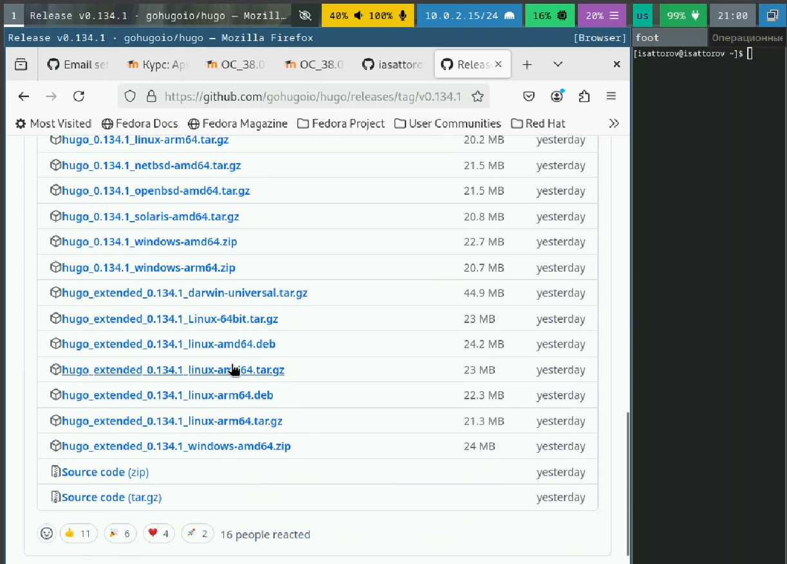{#fig:1 width=100%}

Распаковка скачанного архива. (рис. [-@fig:2])

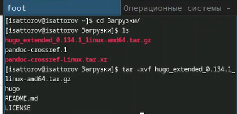{#fig:2 width=100%}

Переместим сам hugo в папку /usr/local/bin для его корректной работы. (рис. [-@fig:3])

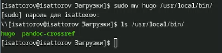{#fig:3 width=100%}

Создадим новый репозиторий, в котором будет храниться информация о нашем сайте, а также отчеты к выполненным этапам. (рис. [-@fig:4])

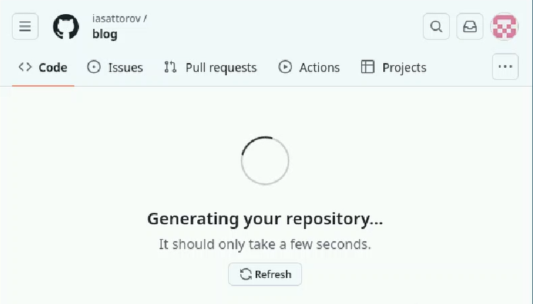{#fig:4 width=100%}

Скопируем в нашу гостевую ОС получившийся в предыдущем шаге репозиторий. (рис. [-@fig:5])

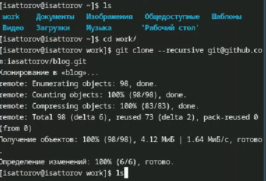{#fig:5 width=100%}

Проверяем, скопировалось ли. (рис. [-@fig:6])

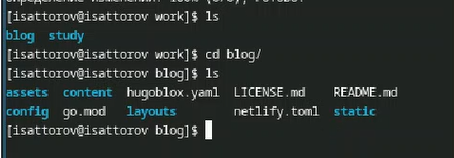{#fig:6 width=100%}

Попытавшись запустить наш сайт на локальном хостинге получаем ошибку об отсутствии языка Go. Установим его. (рис. [-@fig:7])

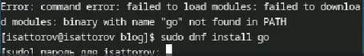{#fig:7 width=100%}

Установленный язык Go. (рис. [-@fig:8])

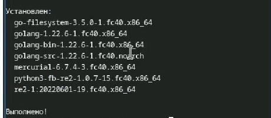{#fig:8 width=100%}

Запускаем наш сайт и получаем ссылку, по которой он локально доступен. (рис. [-@fig:9])

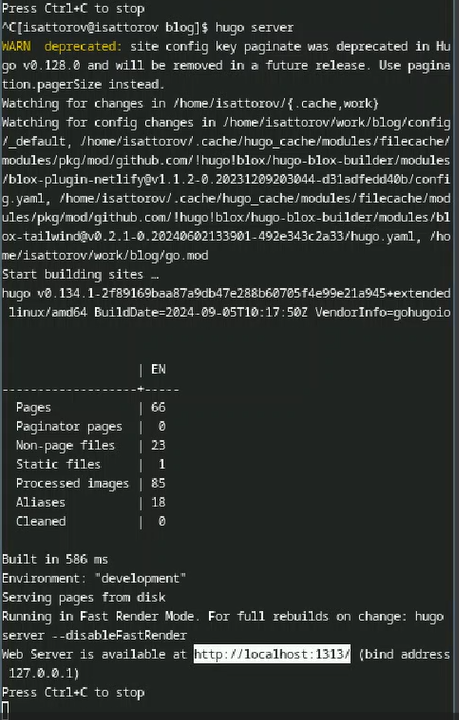{#fig:9 width=100%}

Шаблон сайта на указанной ссылке. (рис. [-@fig:10])

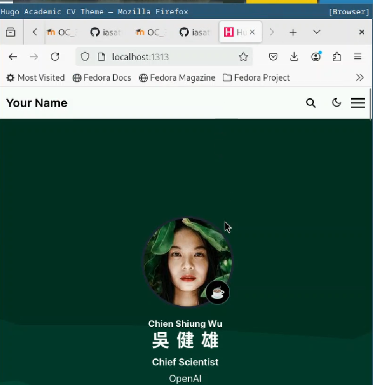{#fig:10 width=100%}

Создадим новый репозиторий, который будет отвечать за наш сайт вне локального хостинга. (рис. [-@fig:11])

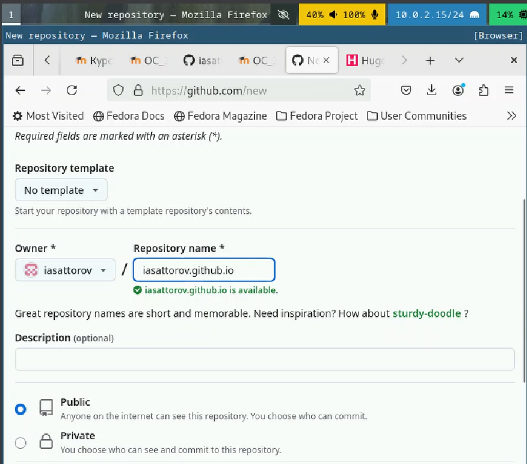{#fig:11 width=100%}

Копируем созданный репозиторий на наш компьютер. (рис. [-@fig:12])

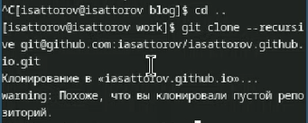{#fig:12 width=100%}

Создадим в новом репозиторие новую ветку 'main', а также создадим в нем файл readme.md, чтобы репозиторий не был пустым, после чего выгрузим всё это на ГитХаб. (рис. [-@fig:13])

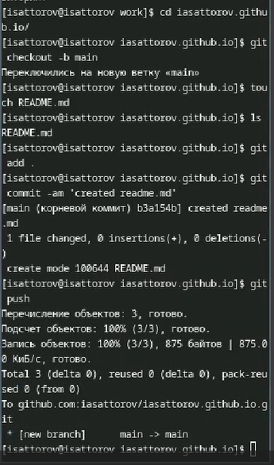{#fig:13 width=100%}

Создадим в папке blog под-ветку этого репозитория; эта папка будет отвечать за выгрузку нового контента на общедоступный сайт. (рис. [-@fig:14])

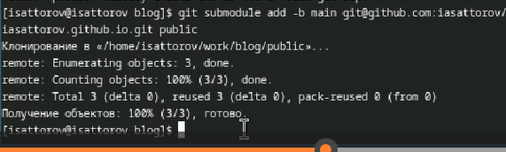{#fig:14 width=100%}

Выгрузим изменения на ГитХаб. (рис. [-@fig:15])

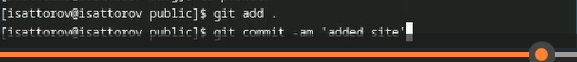{#fig:15 width=100%}

Все еще выгрузка на ГитХаб. (рис. [-@fig:16])

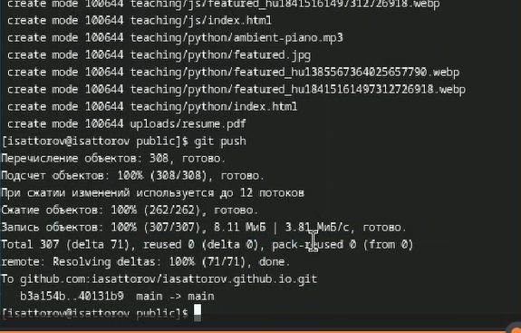{#fig:16 width=100%}

Шаблон сайта, примененный к репозиторию. (рис. [-@fig:17])

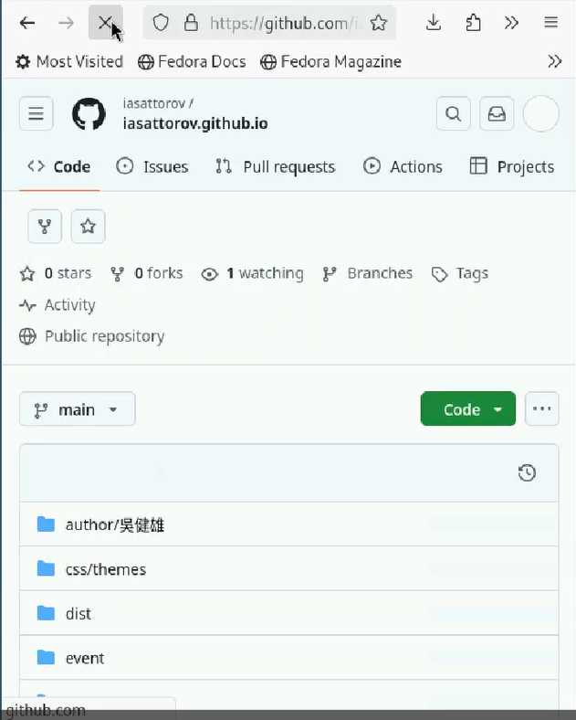{#fig:17 width=100%}

Сайт на постоянной ссылке. (рис. [-@fig:18])

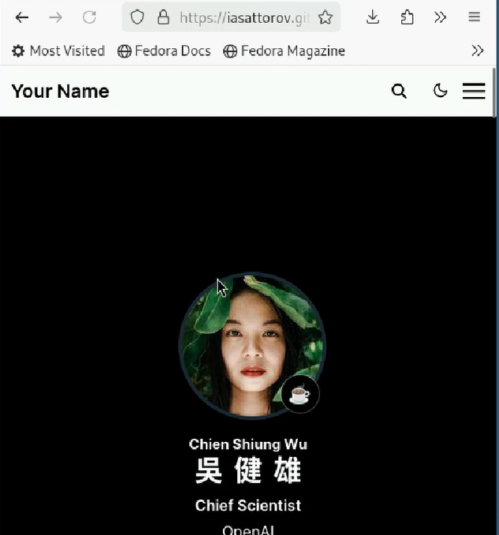{#fig:18 width=100%}

# Выводы

Мы провели первичную настройку нашего будущего сайта.
