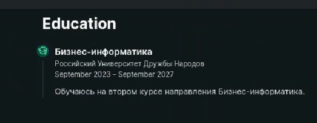
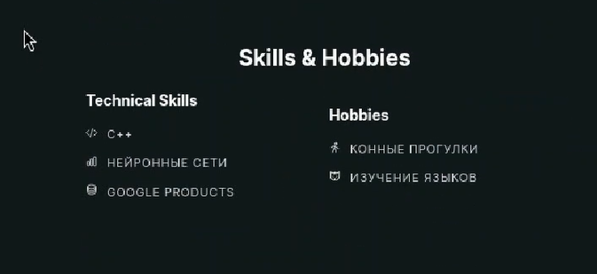
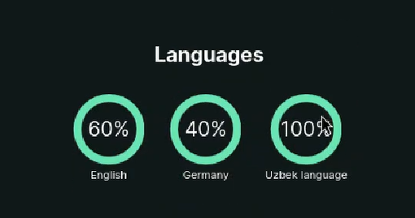
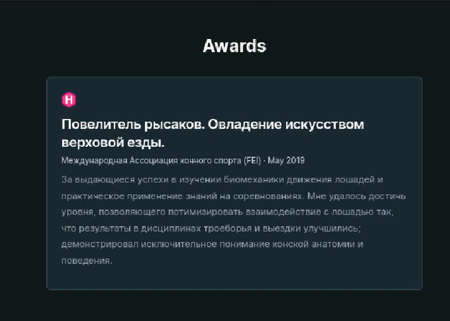
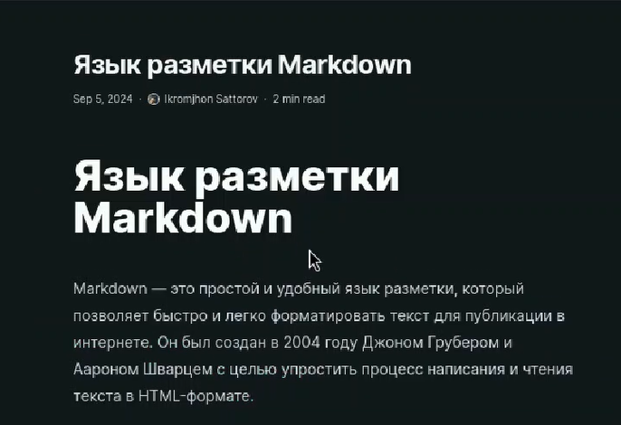
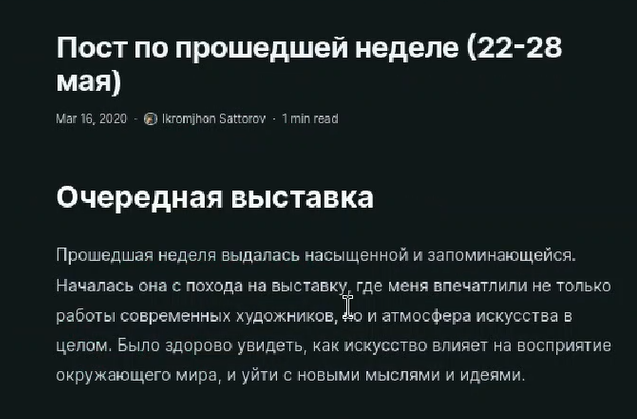

---
## Front matter
title: "Отчёт по индивидуальному проекту"
subtitle: "Стадия 3"
author: "Икромджон Сатторов"

## Generic otions
lang: ru-RU
toc-title: "Содержание"

## Bibliography
bibliography: bib/cite.bib
csl: pandoc/csl/gost-r-7-0-5-2008-numeric.csl

## Pdf output format
toc: true # Table of contents
toc-depth: 2
lof: true # List of figures
lot: true # List of tables
fontsize: 12pt
linestretch: 1.5
papersize: a4
documentclass: scrreprt
## I18n polyglossia
polyglossia-lang:
  name: russian
  options:
	- spelling=modern
	- babelshorthands=true
polyglossia-otherlangs:
  name: english
## I18n babel
babel-lang: russian
babel-otherlangs: english
## Fonts
mainfont: PT Serif
romanfont: PT Serif
sansfont: PT Sans
monofont: PT Mono
mainfontoptions: Ligatures=TeX
romanfontoptions: Ligatures=TeX
sansfontoptions: Ligatures=TeX,Scale=MatchLowercase
monofontoptions: Scale=MatchLowercase,Scale=0.9
## Biblatex
biblatex: true
biblio-style: "gost-numeric"
biblatexoptions:
  - parentracker=true
  - backend=biber
  - hyperref=auto
  - language=auto
  - autolang=other*
  - citestyle=gost-numeric
## Pandoc-crossref LaTeX customization
figureTitle: "Рис."
tableTitle: "Таблица"
listingTitle: "Листинг"
lofTitle: "Список иллюстраций"
lotTitle: "Список таблиц"
lolTitle: "Листинги"
## Misc options
indent: true
header-includes:
  - \usepackage{indentfirst}
  - \usepackage{float} # keep figures where there are in the text
  - \floatplacement{figure}{H} # keep figures where there are in the text
---

# Цель работы

Добавить информацию на сайт о моих навыках, достижениях, опыте, а также сделать два поста: недельный и на выбор.

# Выполнение лабораторной работы

Укажем места, где я учился. (рис. [-@fig:1])

{#fig:1 width=100%}

Укажем мои навыки и хобби. (рис. [-@fig:2])

{#fig:2 width=100%}

Также укажем языки, которыми я владею. (рис. [-@fig:3])

{#fig:3 width=100%}

Укажем достижения, которыми я обладаю. (рис. [-@fig:4])

{#fig:4 width=100%}

Напишем пост на тему по выбору. (рис. [-@fig:5])

{#fig:5 width=100%}

И напишем пост о прошедшей неделе. (рис. [-@fig:6])

{#fig:6 width=100%}

# Выводы

Информация обо мне на сайте была дополнена навыками, опытом и достижениями, а также были написаны два поста.
