---
## Front matter
lang: ru-RU
title: Индивидуальный проект. Стадия 6.
subtitle: Презентация
author:
  - Сатторов И.
institute:
  - Российский университет дружбы народов, Москва, Россия
date: 4 сентября 2024

## i18n babel
babel-lang: russian
babel-otherlangs: english

## Formatting pdf
toc: false
toc-title: Содержание
slide_level: 2
aspectratio: 169
section-titles: true
theme: metropolis
header-includes:
 - \metroset{progressbar=frametitle,sectionpage=progressbar,numbering=fraction}
 - '\makeatletter'
 - '\beamer@ignorenonframefalse'
 - '\makeatother'
 
## Fonts
mainfont: PT Serif
romanfont: PT Serif
sansfont: PT Sans
monofont: PT Mono
mainfontoptions: Ligatures=TeX
romanfontoptions: Ligatures=TeX
sansfontoptions: Ligatures=TeX,Scale=MatchLowercase
monofontoptions: Scale=MatchLowercase,Scale=0.9
---

# Информация

## Докладчик

:::::::::::::: {.columns align=center}
::: {.column width="70%"}

  * Сатторов Икромджон
  * Студент
  * Российский университет дружбы народов
  * [1032234755@pfur.ru](mailto:1032234755@pfur.ru)

:::
::: {.column width="30%"}

:::
::::::::::::::

## Цель

Перевести сайт на английский язык, а также весь контент, находящийся на нем.

## переведенные элементы

Все элементы сайта, переведенные на английский язык.

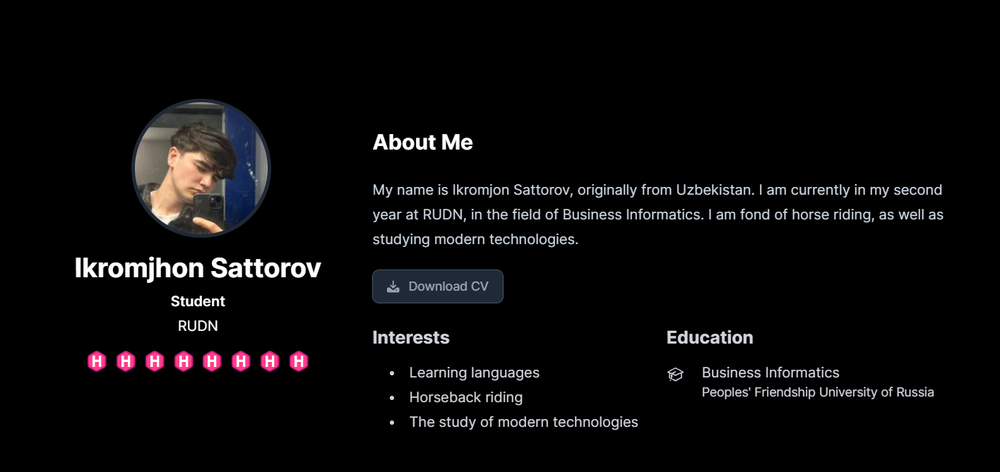{height=50%}

##

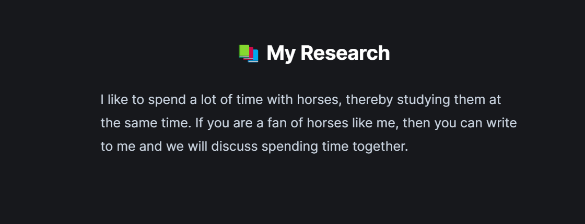{#fig:1 width=100%}

##

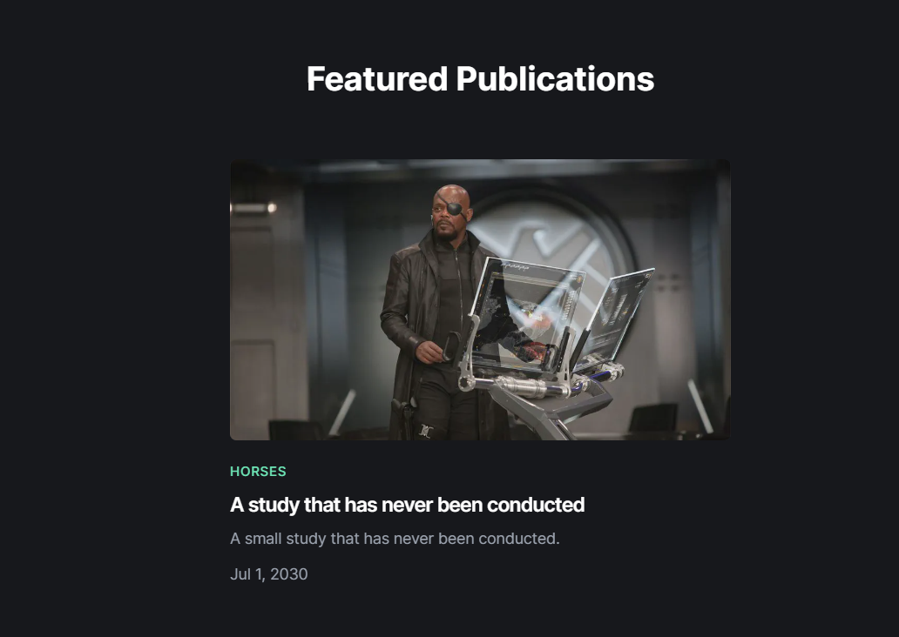{#fig:1 width=100%}

##

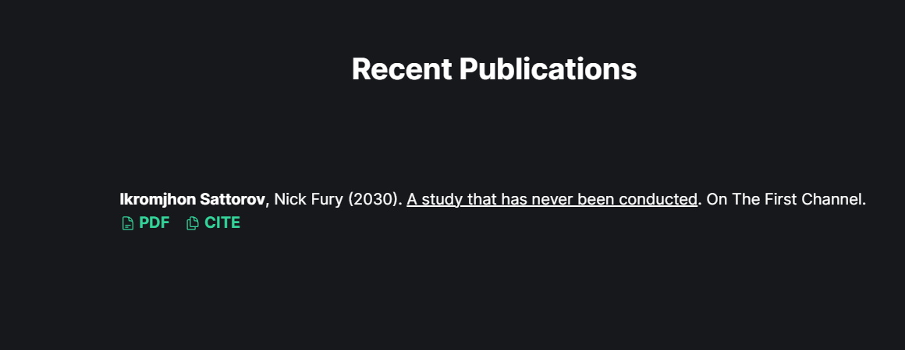{#fig:1 width=100%}

##

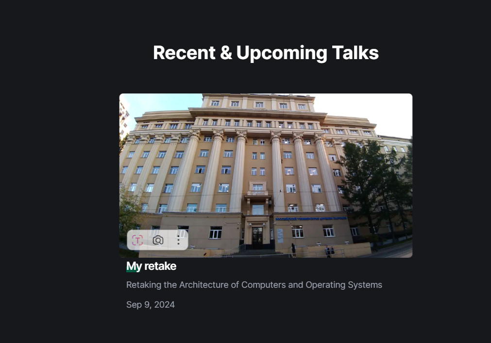{#fig:1 width=100%}

##

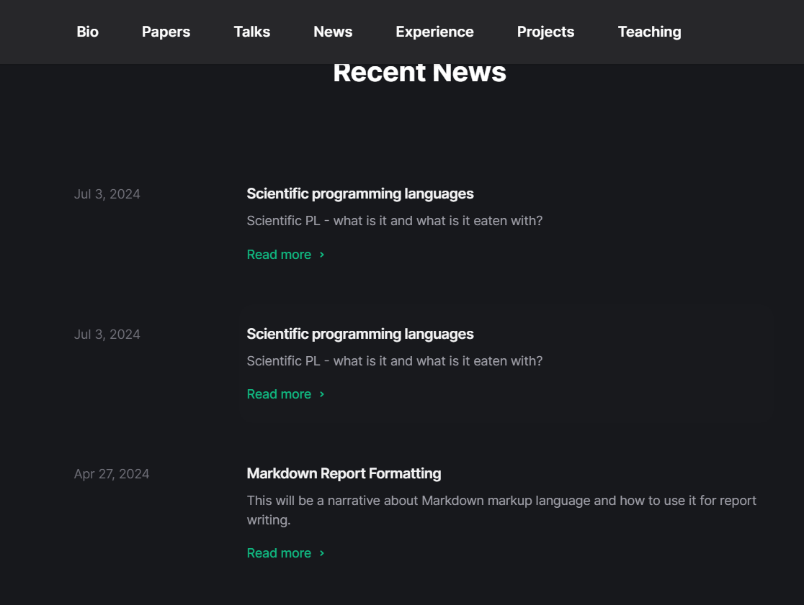{#fig:1 width=100%}

##

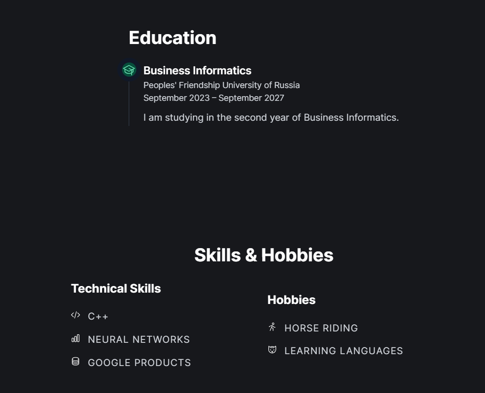{#fig:1 width=100%}

##

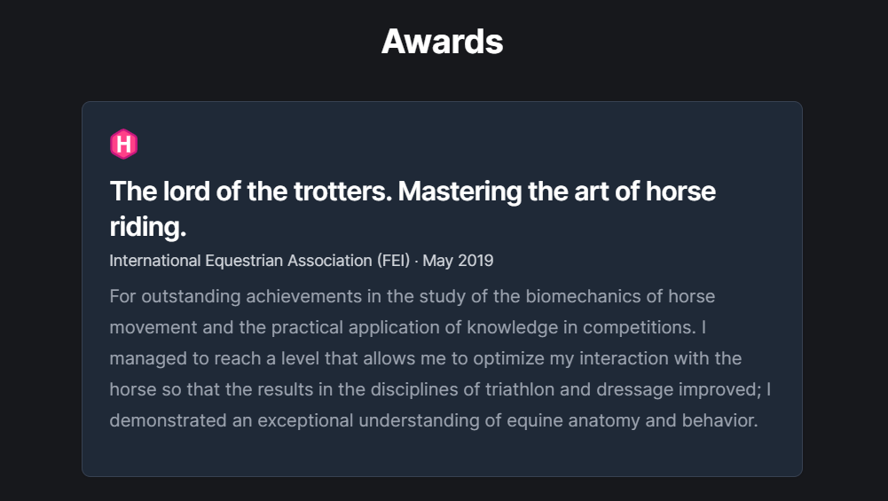{#fig:1 width=100%}

##

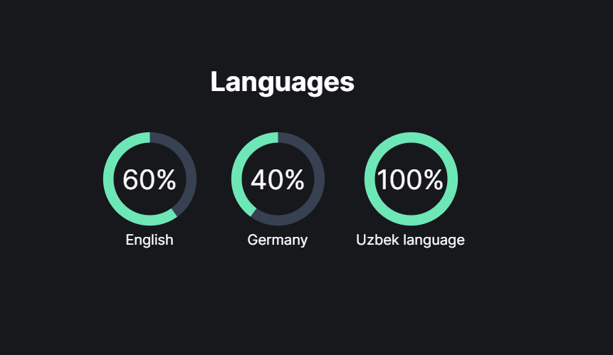{#fig:1 width=100%}

##

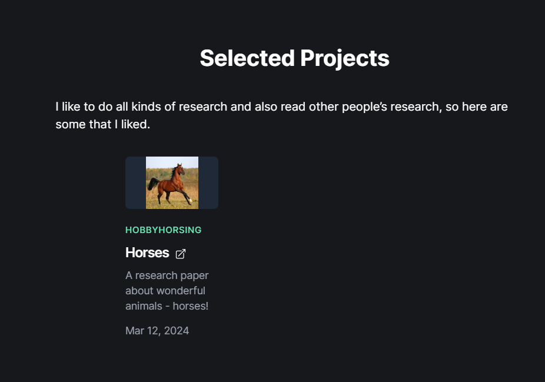{#fig:1 width=100%}

##

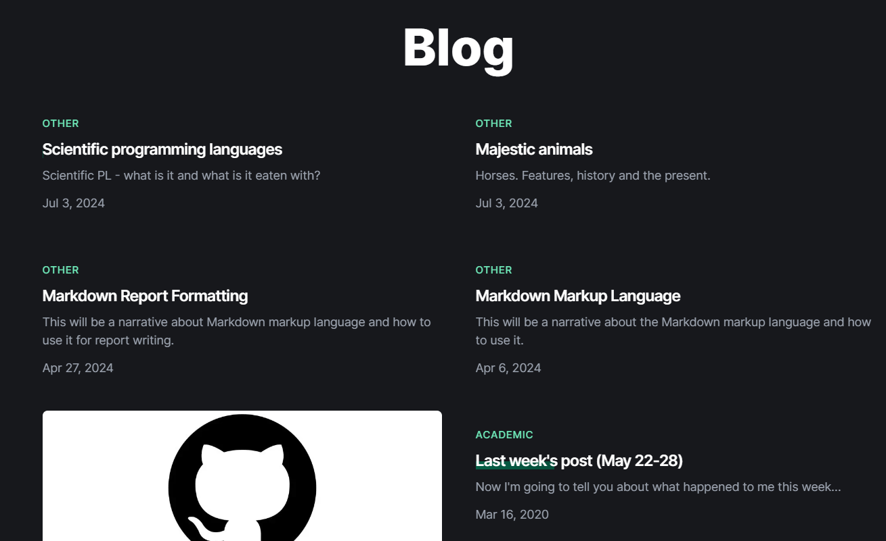{#fig:1 width=100%}

## 

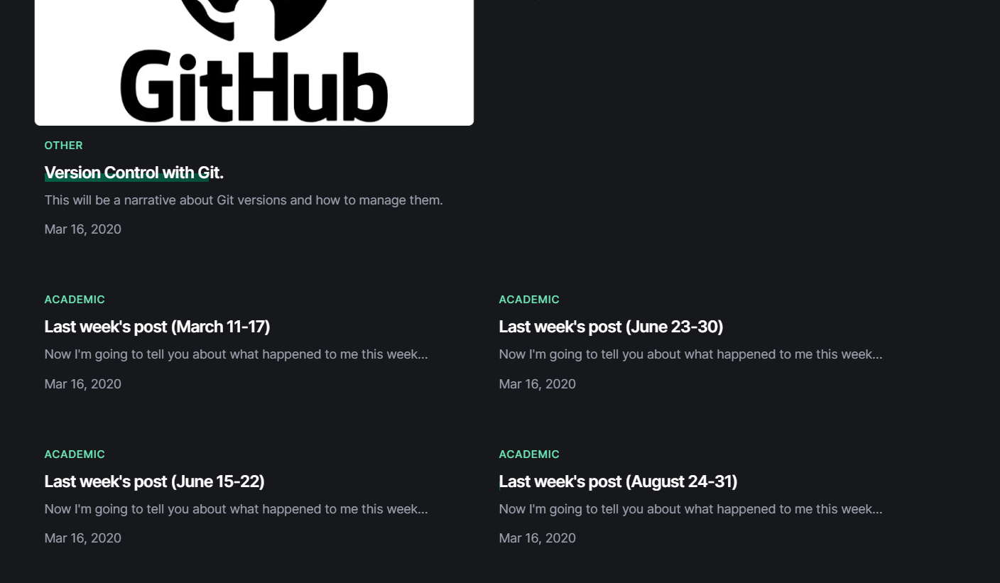{#fig:1 width=100%}

##переключатель языка

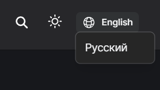{#fig:1 width=100%}

## пост о неделе

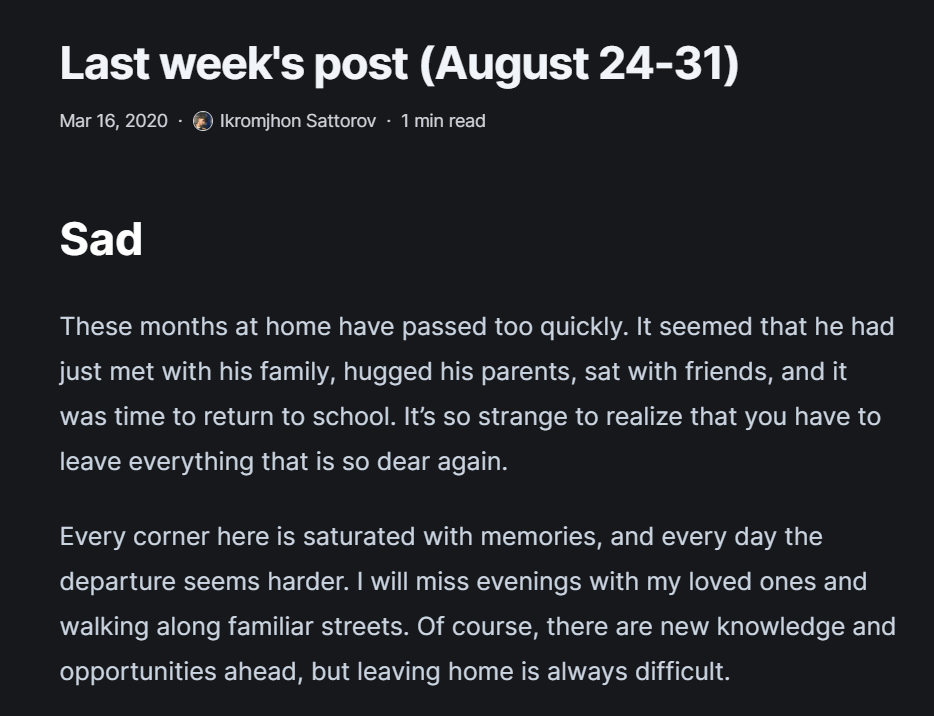{height=50%}

## пост на выбор

Пост на тему по выбору

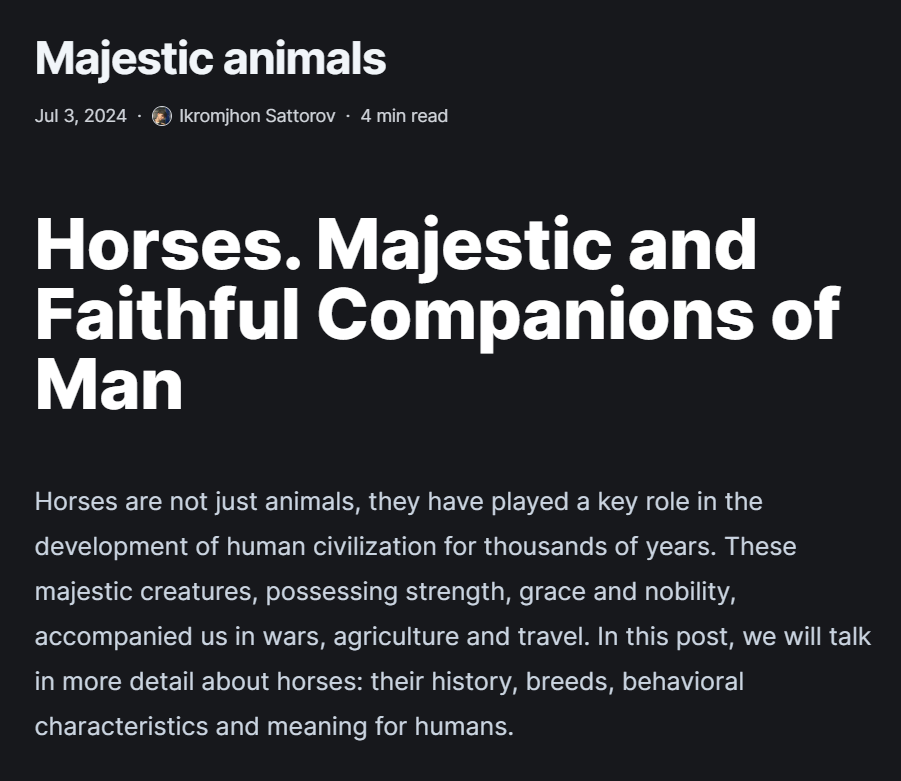{height=50%}

## Выводы

Мы перевели сайт и весь контент на английский язык, тем самым завершили индивидуальный проект!!

