---
## Front matter
title: "Отчёт по индивидуальному проекту"
subtitle: "Стадия 6"
author: "Икромджон Сатторов"

## Generic otions
lang: ru-RU
toc-title: "Содержание"

## Bibliography
bibliography: bib/cite.bib
csl: pandoc/csl/gost-r-7-0-5-2008-numeric.csl

## Pdf output format
toc: true # Table of contents
toc-depth: 2
lof: true # List of figures
lot: true # List of tables
fontsize: 12pt
linestretch: 1.5
papersize: a4
documentclass: scrreprt
## I18n polyglossia
polyglossia-lang:
  name: russian
  options:
	- spelling=modern
	- babelshorthands=true
polyglossia-otherlangs:
  name: english
## I18n babel
babel-lang: russian
babel-otherlangs: english
## Fonts
mainfont: PT Serif
romanfont: PT Serif
sansfont: PT Sans
monofont: PT Mono
mainfontoptions: Ligatures=TeX
romanfontoptions: Ligatures=TeX
sansfontoptions: Ligatures=TeX,Scale=MatchLowercase
monofontoptions: Scale=MatchLowercase,Scale=0.9
## Biblatex
biblatex: true
biblio-style: "gost-numeric"
biblatexoptions:
  - parentracker=true
  - backend=biber
  - hyperref=auto
  - language=auto
  - autolang=other*
  - citestyle=gost-numeric
## Pandoc-crossref LaTeX customization
figureTitle: "Рис."
tableTitle: "Таблица"
listingTitle: "Листинг"
lofTitle: "Список иллюстраций"
lotTitle: "Список таблиц"
lolTitle: "Листинги"
## Misc options
indent: true
header-includes:
  - \usepackage{indentfirst}
  - \usepackage{float} # keep figures where there are in the text
  - \floatplacement{figure}{H} # keep figures where there are in the text
---

# Цель работы

Перевести сайт на английский язык, а также весь контент, находящийся на нем.

# Выполнение лабораторной работы

Все элементы сайта, переведенные на английский язык. (рис. [-@fig:1])(рис. [-@fig:2])(рис. [-@fig:3])(рис. [-@fig:4])(рис. [-@fig:5])(рис. [-@fig:6])(рис. [-@fig:7])(рис. [-@fig:8])(рис. [-@fig:9])(рис. [-@fig:10])(рис. [-@fig:11])(рис. [-@fig:12])

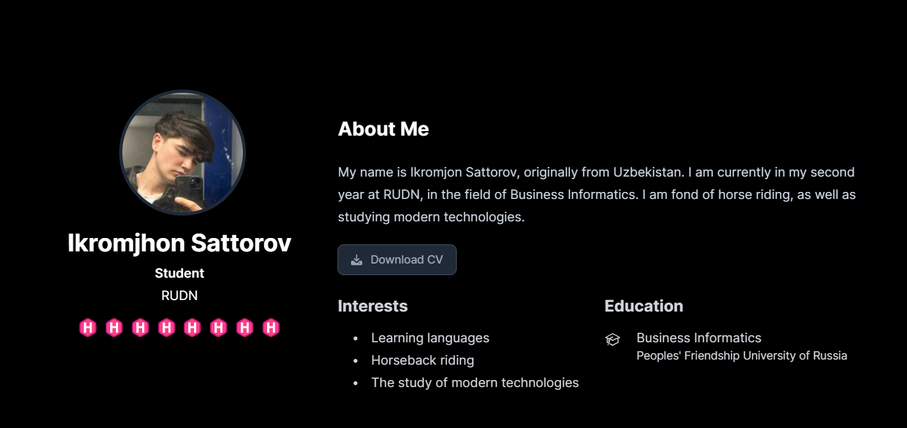{#fig:1 width=100%}

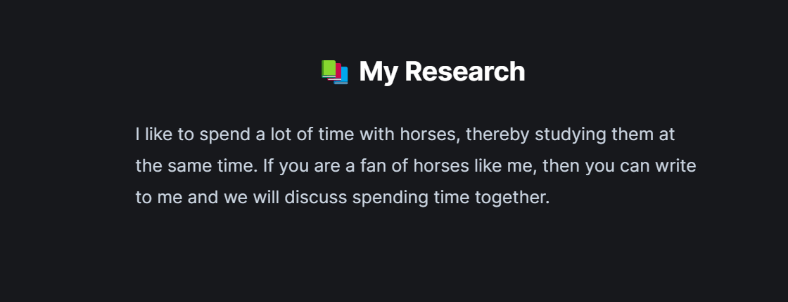{#fig:2 width=100%}

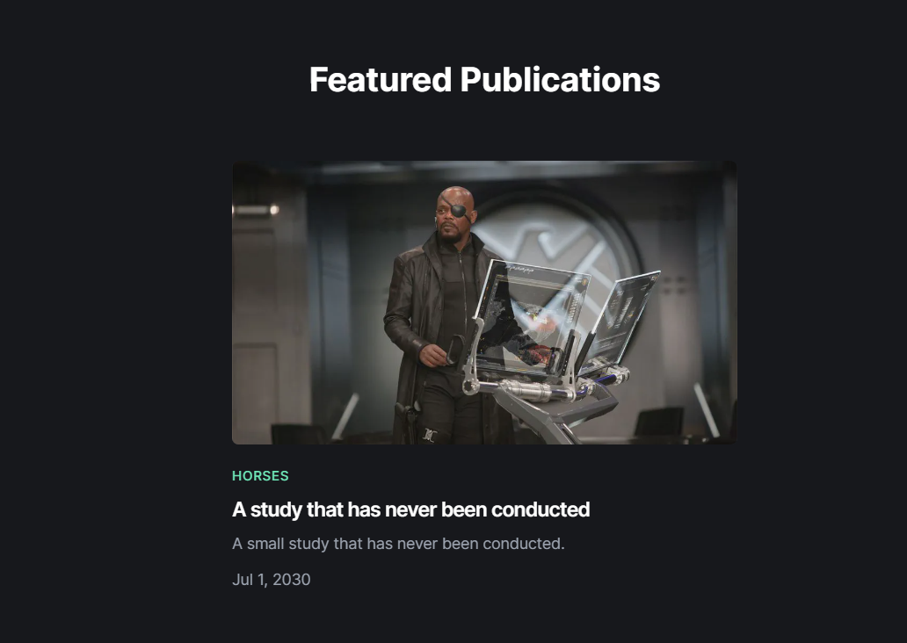{#fig:3 width=100%}

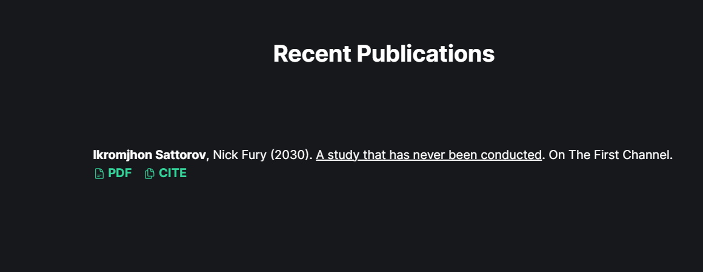{#fig:4 width=100%}

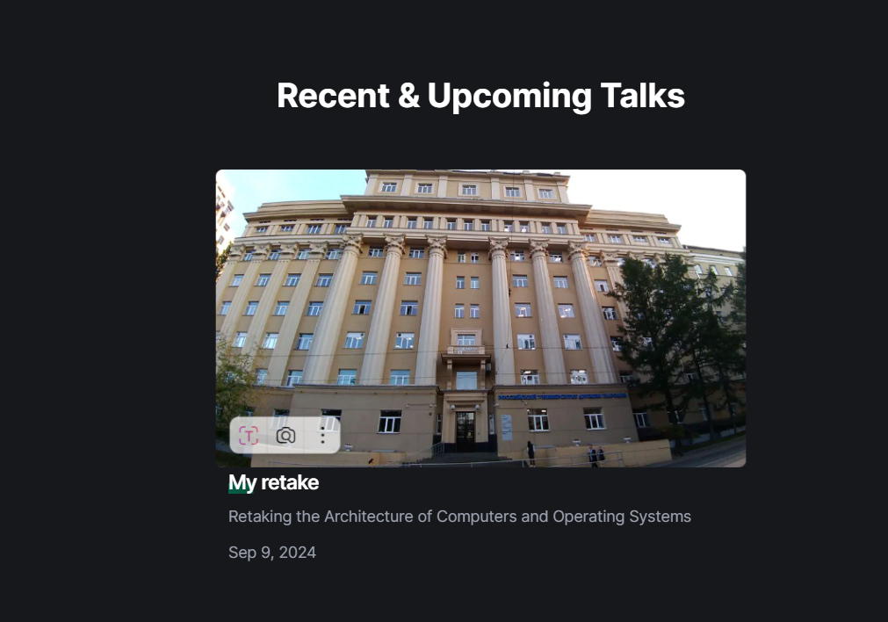{#fig:5 width=100%}

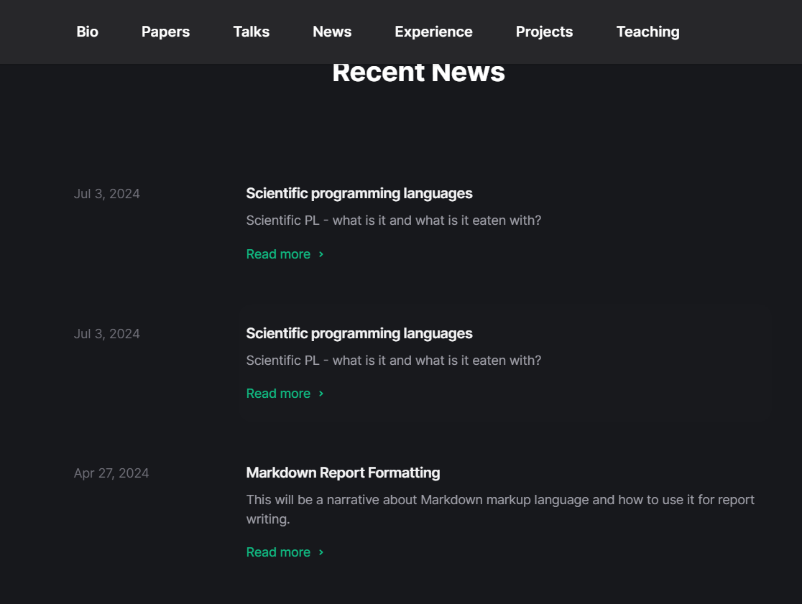{#fig:6 width=100%}

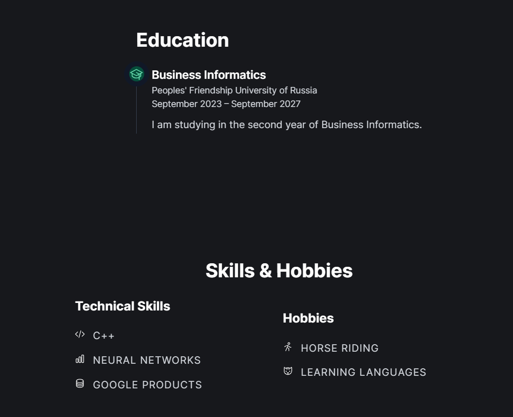{#fig:7 width=100%}

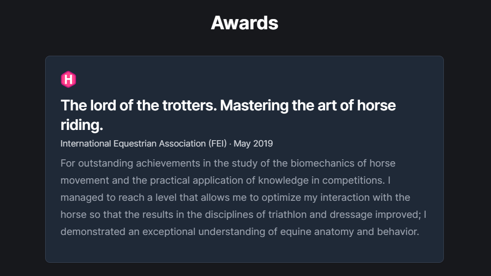{#fig:8 width=100%}

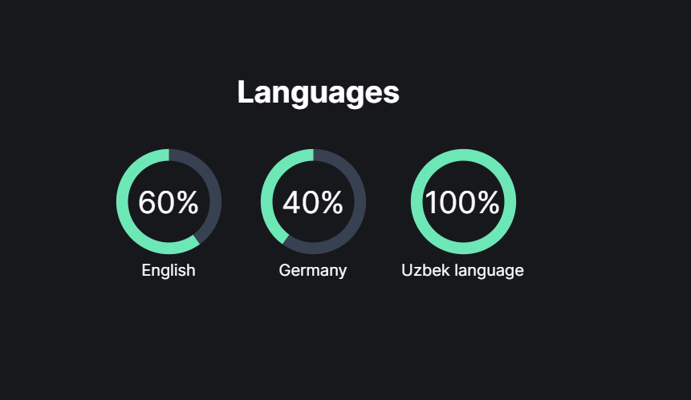{#fig:9 width=100%}

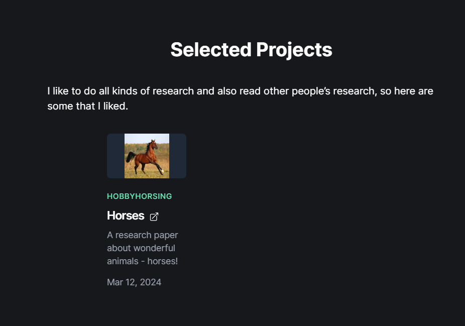{#fig:10 width=100%}

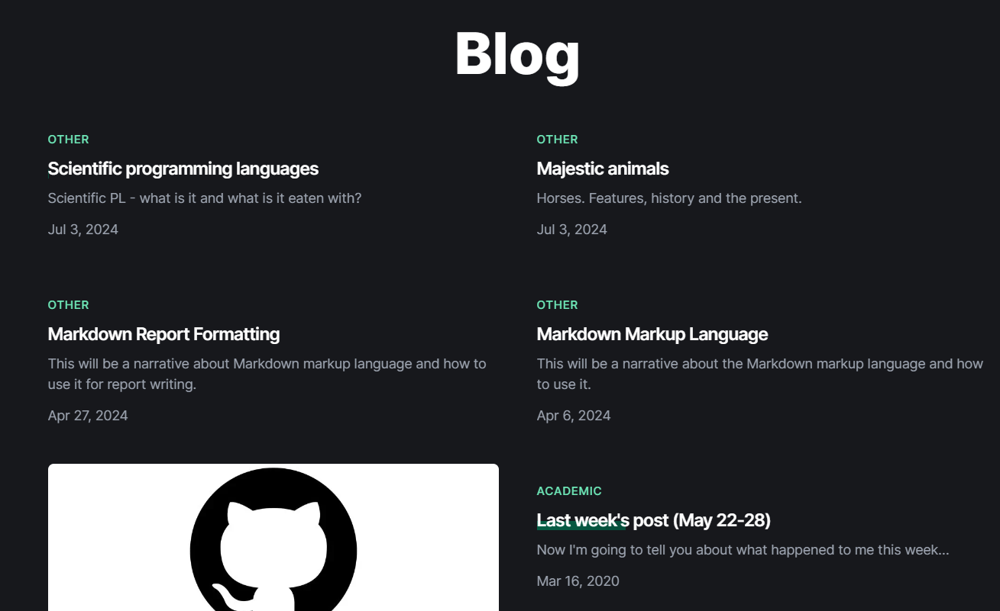{#fig:11 width=100%}

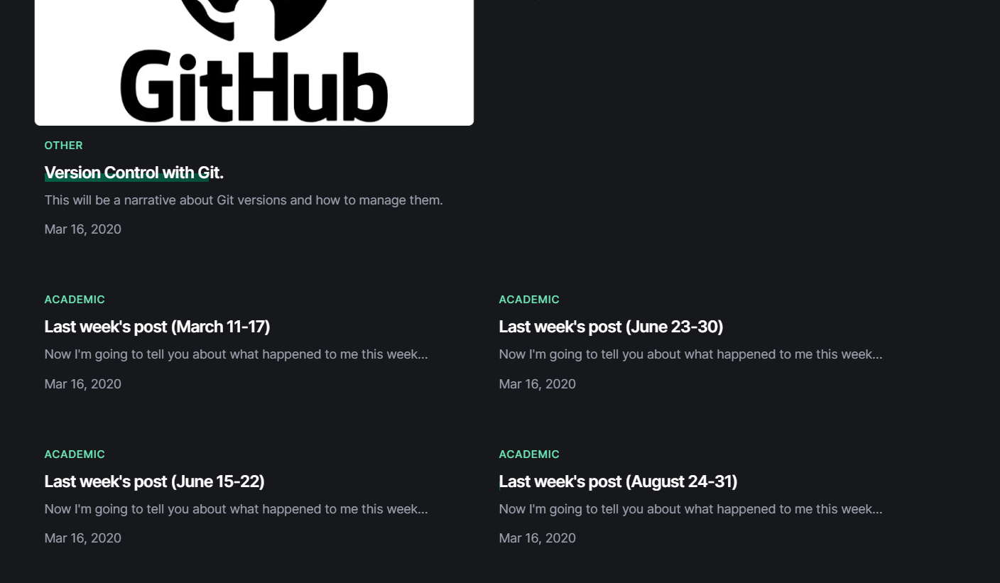{#fig:12 width=100%}

И сам переключатель языков. (рис. [-@fig:13])

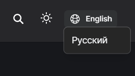{#fig:13 width=100%}

Пост о прошедшей неделе(рис. [-@fig:14])

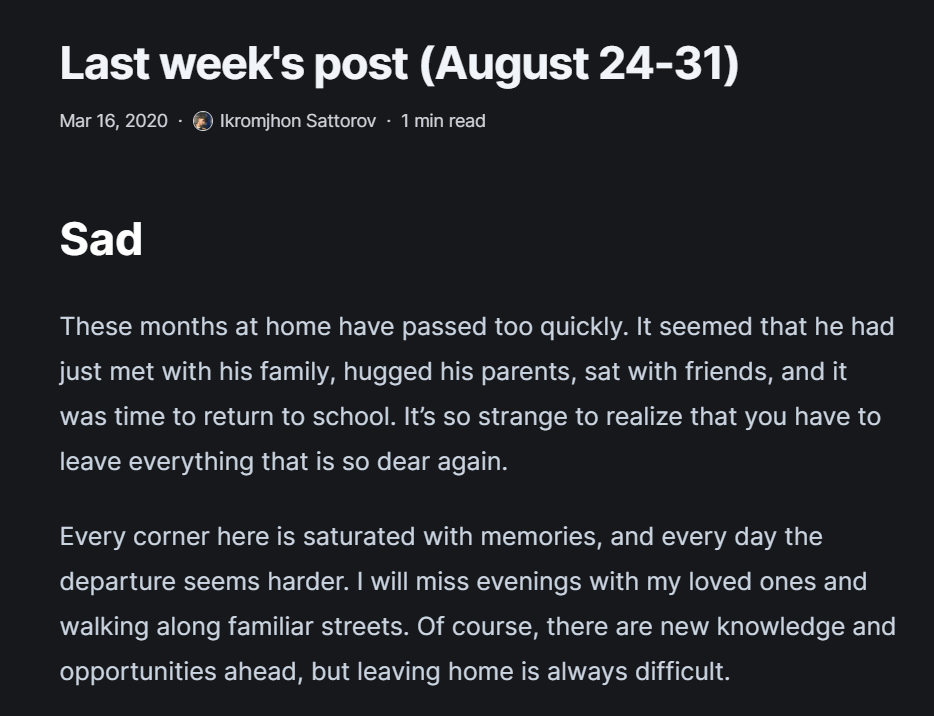{#fig:14 width=100%}

Пост на тему по выбору. Тем предоставлен не было, поэтому я сделал про моих любимых коняшек. (рис. [-@fig:15])

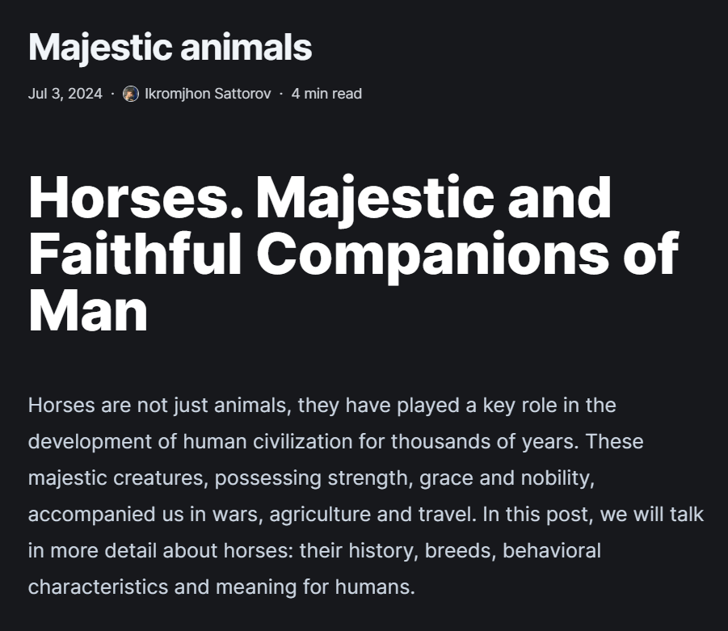{#fig:15 width=100%}

# Выводы

Мы перевели сайт и весь контент на английский язык, тем самым завершили индивидуальный проект!!
